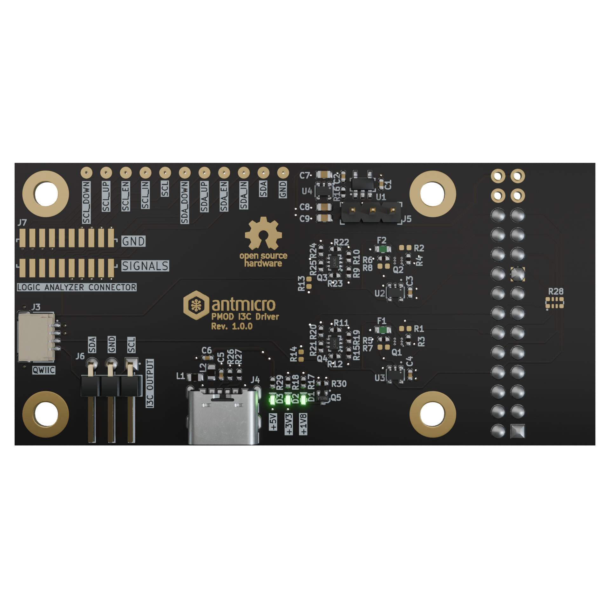

# PMOD I3C Driver

Copyright (c) 2024 [Antmicro](https://www.antmicro.com)

## Overview

This project contains open hardware design files for a simple expansion PCB with two push-pull digital output drivers composed of discrete MOSFETs.
This allows to use the board with FPGA-driven systems to implement I3C output stage driver which can act as open drain or push-pull. 
The driver topology is switchable via digital control signals from FPGA-side.
A separate set of control signals allows to activate pull-up or pull-down resistors connected to the output signals.
The design files were prepared in KiCad 9.x.

## Key features

* Two independent digital output stages configurable as push-pull or open drain
* Switchable pull-up and pull-down resistors
* The board is compatible with PMOD (3.3V logic) expansion connector 
* The board is compatible with a 24-pin proto header (J3) available on AMD (Xilinx) [ZCU106 Evaluation Kit](https://www.xilinx.com/products/boards-and-kits/zcu106.html) 

## Project structure

The main directory contains KiCad PCB project files, a LICENSE, and a README.
The remaining files are stored in the following directories: 

* `img` - contains graphics for this README 
* `doc` - contains board schematic in PDF format

## Licensing

This project is published under the [Apache-2.0](LICENSE) license.

